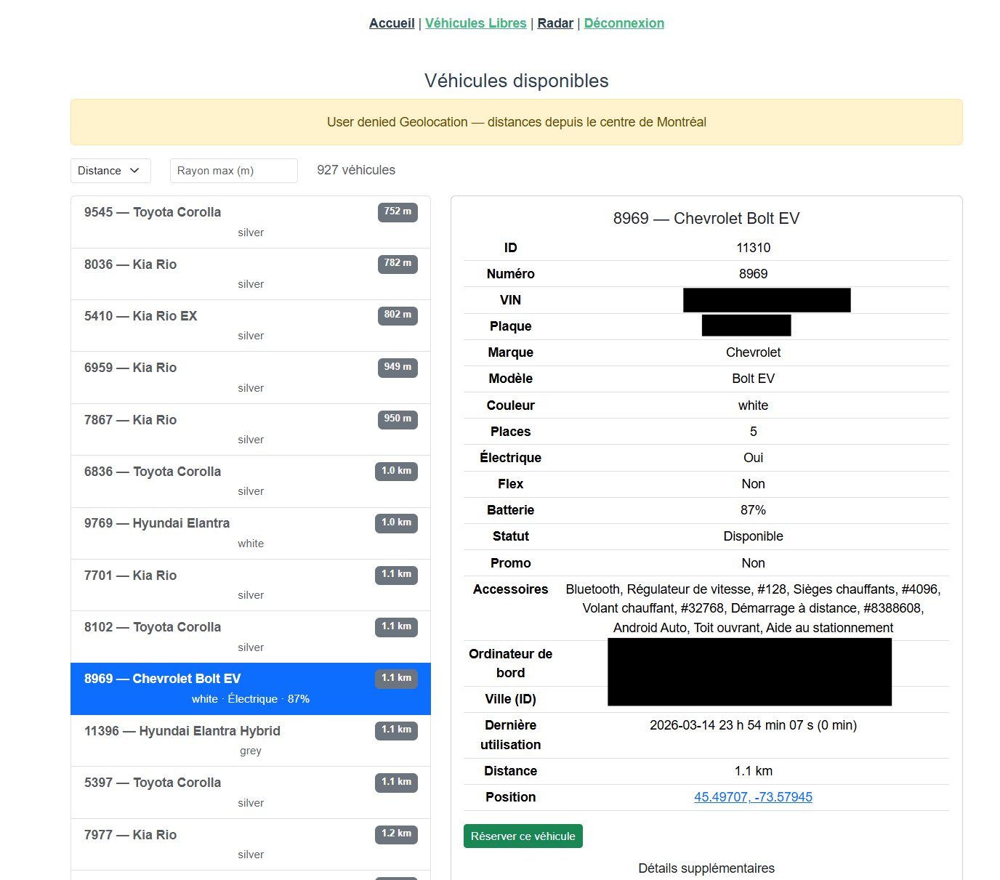
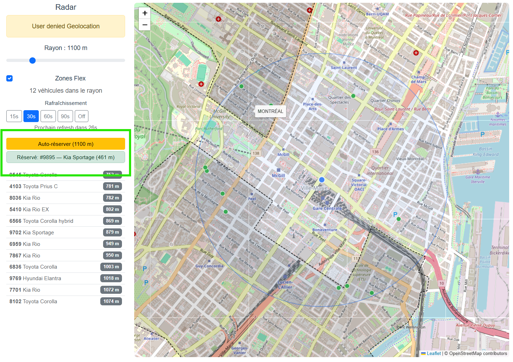

# Communauto Tools

> Browse, locate, and book Communauto car-sharing vehicles in Montreal — in real time.

Communauto Tools is a fast, lightweight web app that connects to the ReserveAuto API to give you a better experience finding and reserving Communauto vehicles.

> **Note:** This app currently only works locally (`npm run dev`). Communauto's API blocks requests from Cloudflare Workers and corsproxy.io, so the production/hosted build cannot reach the ReserveAuto endpoints. The Vite dev server proxy works fine for local development.

## Features

### Vehicle List
- View all available vehicles in real time
- Sort by **distance**, battery level, vehicle number, or brand
- Filter by radius (0–5 km from your location)
- One-click booking and cancellation



### Radar (Map View)
- Interactive **OpenStreetMap** with vehicle markers
- See your current position and configurable search radius
- Color-coded markers (green = within radius, grey = outside)
- Flex zone overlay (GeoJSON)
- **Auto-refresh** (15–90 s intervals)
- **Auto-book** — automatically reserve the first vehicle that appears in your radius



### Authentication
- Connects with your ReserveAuto session cookies
- Optional REST API token for extended features
- Credentials stored in `sessionStorage` (cleared on tab close)

## Tech Stack

| Layer | Technology |
|-------|-----------|
| Framework | Vue 3.5 + TypeScript 5 |
| Build | Vite 6 |
| Maps | Leaflet 1.9 |
| HTTP | Axios 1.7 |
| Styling | Bootstrap 5.3 + SCSS |
| CORS Proxy | Cloudflare Workers (optional) |

## Getting Started

### Prerequisites

- Node.js 18+
- npm 9+

### Install & Run

```bash
# Install dependencies
npm install

# Start dev server (http://localhost:5173)
npm run dev
```

### Build for Production

```bash
npm run build
npm run preview   # preview the production build locally
```

### Lint

```bash
npm run lint
```

## CORS Proxy (Cloudflare Worker)

In production, a Cloudflare Worker proxies requests to the ReserveAuto API with proper CORS headers.

```bash
cd workers/cors-proxy
npm install
npm run dev       # local development
npm run deploy    # deploy to Cloudflare
```

After deploying, set `VITE_CORS_PROXY_URL` in `.env.production`:

```
VITE_CORS_PROXY_URL=https://communauto-cors-proxy.<your-subdomain>.workers.dev
```

The worker supports `ALLOWED_ORIGIN` (comma-separated) and `TARGET_HOST` configuration via `wrangler.toml` or the Cloudflare dashboard.

## Project Structure

```
src/
├── views/
│   ├── Home.vue              # Landing page
│   ├── VehiculeList.vue      # Vehicle list with detail panel
│   └── Radar.vue             # Leaflet map view
├── composables/
│   ├── useAuth.ts            # Authentication state
│   ├── useGeolocation.ts     # Browser geolocation
│   └── useVehicles.ts        # Vehicle fetching & distance calc
├── services/
│   └── communautoDataService.ts  # ReserveAuto API client
├── types/                    # TypeScript interfaces
├── router/                   # Vue Router config
└── assets/                   # Static assets
```

## License

[AGPL-3.0](LICENSE)
